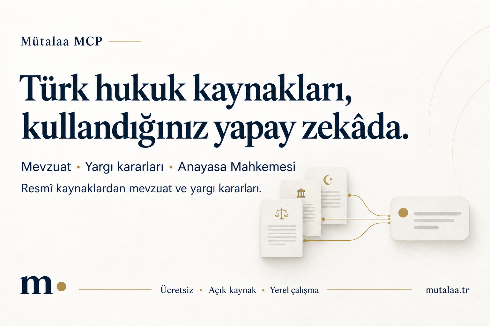

# Mütalaa MCP

**Research Turkish legal sources from the AI app you already use.**
Free, open source, and running on your computer.

[Setup guide](docs/client-setup/README.en.md) · [Türkçe](README.md) · [Mütalaa](https://mutalaa.tr/)

## What can you do?

- Search legislation, judicial decisions, and Constitutional Court decisions.
- Read the relevant article or document and open its official source.
- Start with everyday questions such as “What shared expenses must a tenant pay?”

## Get started

You need a **Mütalaa account**, an internet connection, and an **AI app that supports local MCP connections**.

1. Follow the [setup guide](docs/client-setup/README.en.md) for your computer. No repository clone or coding is required.
2. Add Mütalaa to your app and sign in.
3. Add the [Mütalaa skill](docs/mutalaa-skill.md) to help the app select the tools for natural legal questions.
4. Try this in a new conversation:

   > Use Mütalaa to find Law No. 193, the Turkish Income Tax Law, and give its official source link.

A `mutalaamcp` tool call shows that Mütalaa was used. If you only see web searches, follow [troubleshooting](docs/client-setup/README.en.md#troubleshooting).

**Installation:** Use the [terminal guide](docs/client-setup/README.en.md) to install a specific release. No unsigned macOS installer is offered; the Windows CMD script is experimental.

## Data and cost

Local use is free, with no commercial-use quota. Your AI app may charge separately.
Processing and the research cache stay on your computer; source requests go to the relevant official services.
Your Mütalaa account is used for sign-in and activation; legal queries and document text are not sent to the activation service.
Your AI app processes your question and tool results under its own data policy.

Mütalaa product announcements may appear separately at the end of an answer. [How announcements work](docs/announcements.md).

## For developers

Eight tools in one local server: research entry point, legislation/decision/Constitutional Court search,
document retrieval, article retrieval, search within legislation, and article outlines.
Inputs and responses are defined in the [tool contract](contracts/tool-surface-v1.json).

- [Contributing and forks](CONTRIBUTING.md)
- [Support and bug reports](SUPPORT.en.md)
- [Reporting vulnerabilities](SECURITY.en.md)

MIT licensed. [License](LICENSE) · [Third-party notices](THIRD_PARTY_NOTICES.en.md) · [Trademark policy](TRADEMARK_POLICY.en.md)

Mütalaa MCP is legal-research software. Verify results against primary sources and consult a qualified professional about a specific matter.
